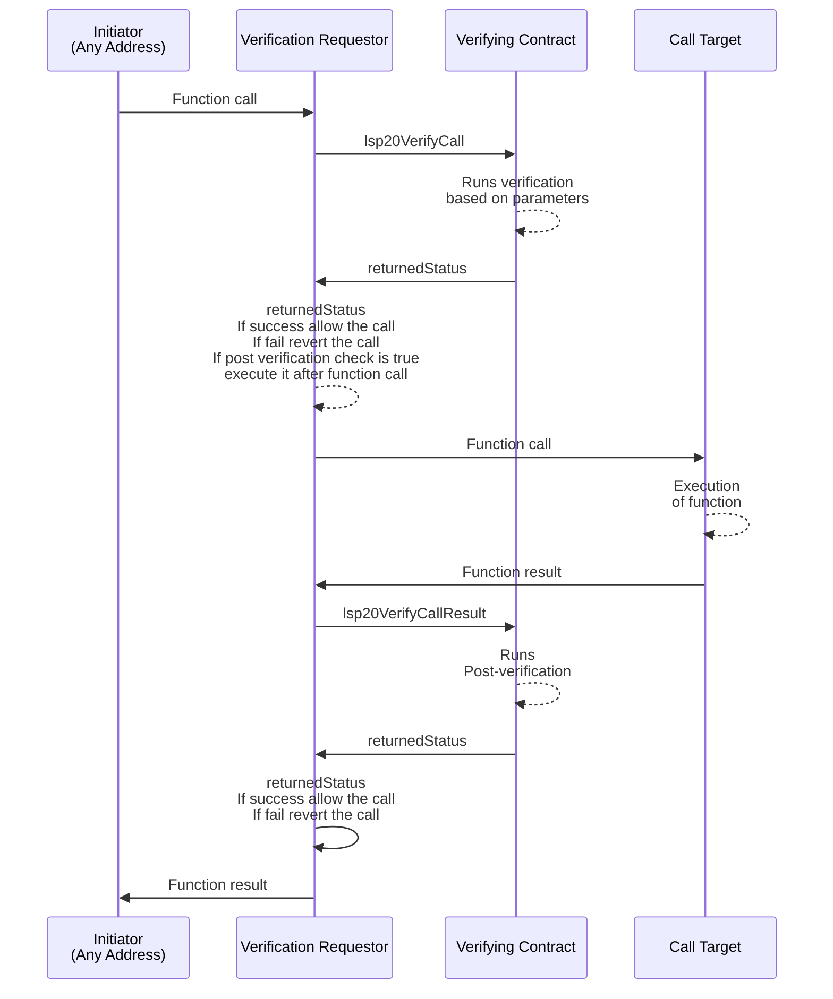

## Simple Summary

This standard introduces a mechanism for delegating the verification of a function call to another contract.

## Abstract

The Call Verification standard introduces a way for a smart contract to delegate the conditions or requirements needed to call a specific function to another smart contract.

This approach offers increased flexibility, where the call requirements can be checked before or/and after the execution of the function being called on another contract and can be changed over time.

## Motivation

In certain situations, a smart contract may need to modify the conditions or requirements for calling a specific function. These requirements might be complex or subject to change, making them difficult to manage within the same contract.

Delegating the function call requirements to another smart contract enables a more dynamic and adaptable approach. This makes it easier to update, modify, or enhance the requirements without affecting the primary contract's functionality. The Call Verification standard aims to provide a solution that allows contracts to be more versatile and adaptable in response to changing conditions or requirements.

## Specification

The LSP20 Call Verification standard involves two key types of contracts, each with a specific role in facilitating the function call verification process:

- **Contract Delegating Verification**: This contract receives the initial function call. It does not implement a specific interface pattern, but rather incorporates logic to delegate verification to a verifier contract. To highlight that this contract implement this type of logic, it MUST support `0x1a0eb6a5` interfaceId, calculated as the first 4 bytes of the keccak256 hash of the string `"LSP20CallVerification"`.

- **Verfying Contract**: Following the **LSP20-CallVerifier** interface, this contract is dedicated to handling the verification process after being called by the contract delegating verification. It should support the **LSP20-CallVerifier** interfaceId: `0x0d6ecac7`, calculated as the XOR of specific functions detailed below.



### Methods

Smart contracts implementing the **LSP20-CallVerifier** interfaceId SHOULD implement both of the functions listed below:

#### lsp20VerifyCall

```solidity
function lsp20VerifyCall(address initiator, address requestor, address caller, uint256 value, bytes memory callData) external returns (bytes4 returnedStatus);
```

Purpose: This function performs pre-verification, it can be used to run any form of verification mechanism **prior to** running the function being called on the requestor.

_Parameters:_

- `initiator`: The address that requested to make the call to `requestor`.
- `requestor`: The address of the contract asking for verification (that implements the logic of delegating the verification to a verifier contract).
- `caller`: The address who called the function on the contract delegating the verification logic.
- `value`: The value sent by the caller to the function called on the contract delegating the verification mechanism.
- `receivedCalldata`: The calldata sent by the caller to the contract delegating the verification mechanism.

_Returns:_

- `returnedStatus`: the status determining if the verification succeeded or not.

_Requirements_

- the `bytes4` success value returned MUST be of the following format:
  - the first 3 bytes MUST be the `lsp20VerifyCall(address,address,address,uint256,bytes)` function selector. This determines if the call to the function is allowed or not.
  - any value for the last 4th byte is accepted.
  - if the 4th byte is `0x01`, this determines if the `lsp20VerifyCallResult(bytes32,bytes)` function should be called after the original function call (The byte that invokes the `lsp20VerifyCallResult(bytes32,bytes)` function is strictly `0x01`).

#### lsp20VerifyCallResult

```solidity
function lsp20VerifyCallResult(bytes32 callHash, bytes memory callResult) external returns (bytes4 returnedStatus);
```

This function is the **post-verification** function, it can be used to run any form of verification mechanism after having run the function being called on the requestor.

_Parameters:_

- `callHash`: The keccak256 hash of the parameters of `lsp20VerifyCall(address,address,address,uint256,bytes)` parameters packed-encoded (concatened).
- `callResult`: the result of the function being called on the contract delegating the verification mechanism.
  - if the function being called returns some data, the `callResult` MUST be the value returned by the function being called as abi-encoded `bytes`.
  - if the function being called does not return any data, the `callResult` MUST be an empty `bytes`.

_Returns:_

- `returnedStatus`: the status determining if the verification succeeded or not.

_Requirements_

- MUST return the `lsp20VerifyCallResult(bytes32,bytes)` function selector if the call to the function is allowed.

### Handling Verification Result

When calling the functions `lsp20VerifyCall(...)` and `lsp20VerifyCallResult(...)`, the LSP20 standard does not differentiate between:

- if a revert occurred when calling one of these functions.
- if these functions executed successfully but returned a non-success value.

Both of these scenarios mean that the verification failed when calling the contract that implements the LSP20 interface.

## Rationale

The `lsp20VerifyCall(..)` and `lsp20VerifyCallResult(..)` functions work in tandem to verify certain conditions before and after the execution of a function within the same transaction. To optimize gas costs and improve efficiency, the `callHash` parameter is introduced in the `lsp20VerifyCallResult(..)` function.

`lsp20VerifyCall(..)` takes the `initiator`, `requestor`, `caller`, `value`, and `data` as parameters and is invoked before the execution of the targeted function. Based on the return value of this function, it is determined whether `lsp20VerifyCallResult(..)` will run.

Instead of passing the same parameters (initiator, requestor, caller, value, data) along with the result of the executed function to `lsp20VerifyCallResult(..)`, the `callHash` parameter is used. The `callHash` is the keccak256 hash of the concatenated `lsp20VerifyCall(..)` parameters. Since both functions are invoked in the same transaction, a user can hash these parameters in `lsp20VerifyCall(..)` and store them under the hash. Later, the stored values can be retrieved using the `callHash` provided in `lsp20VerifyCallResult(..)`.

This approach has been adopted because passing the same parameters again would be expensive in terms of gas costs, and it's not always necessary for the user to access these parameters in `lsp20VerifyCallResult(..)`. If a user needs to use these parameters, they should store them in the contract storage during the `lsp20VerifyCall(..)` invocation.

_Example: Reentrancy Check_

In a case where the parameters are not relevant for `lsp20VerifyCallResult(..)`, such as checking for reentrancy, the first `lsp20VerifyCall(..)` function will be checking for reentrancy and will set the reentrancy flag to `true`. Then, `lsp20VerifyCallResult(..)` can simply set the reentrancy flag back to false without needing access to the original parameters.

## Implementation

An implementation can be found in the [lukso-network/lsp-smart-contracts] repository.

## Interface Cheat Sheet

```solidity
interface ILSP20  /* is ERC165 */ {

  function lsp20VerifyCall(address initiator, address requestor, address caller, uint256 value, bytes memory receivedCalldata) external returns (bytes4 returnedStatus);

  function lsp20VerifyCallResult(bytes32 callHash, bytes memory callResult) external returns (bytes4);

}
```

## Copyright

Copyright and related rights waived via [CC0](https://creativecommons.org/publicdomain/zero/1.0/).

[lukso-network/lsp-smart-contracts]: https://github.com/lukso-network/lsp-smart-contracts/blob/develop/contracts/
