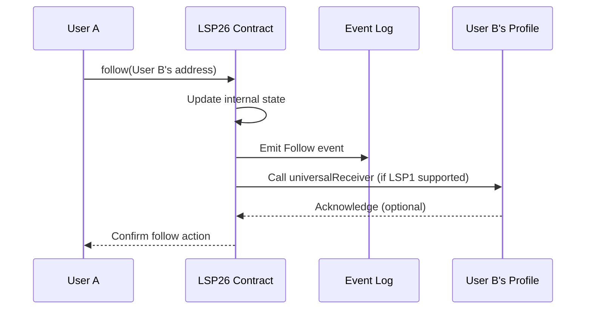

## Simple Summary

This standard describes a blockchain smart contract registry that allows storing two lists of addresses:

1. A list of addresses that an address is following. (follows)
2. A list of addresses that follow an address. (followers)

This can be used primarily for smart contract accounts, such as [ERC725Account](./LSP-0-ERC725Account.md), but also for any smart contracts and EOAs.

## Abstract

The arrays describe two lists of addresses, follows and followers, primarily [ERC725Account](./LSP-0-ERC725Account.md) profiles. Apps can use this data to curate a profiles home page based on the profiles, protocols and other smart contracts it is following.

One can access the two distinctive lists of followers by using the functions [`getFollowsByIndex`](#getFollowsByIndex) & [`getFollowersByIndex`](#getFollowersByIndex). The two functions are built with pagination in mind.

Indexing services are not required to create the lists of followers, but can be used to ease the access to the information when huge amount of data is needed, e.g. to build up complex follower graphs.



## Specification

### Methods

#### follow

```solidity
function follow(address addr) external;
```

Follow a specific address.
Emits [`Follow`](#follow-1) event when following an address.

**LSP1 Hooks:**

- If the followed address supports [LSP1-UniversalReceiver] interface, SHOULD call the follower's [`universalReceiver(...)`] function with the default parameters below:

  - `typeId`: `keccak256('LSP26FollowerSystem_FollowNotification')` > `0x71e02f9f05bcd5816ec4f3134aa2e5a916669537ec6c77fe66ea595fabc2d51a`
  - `data`: The data sent SHOULD be packed encoded and contain the address that starts following.

#### followBatch

```solidity
function followBatch(address[] memory addresses) external;
```

Follow a list of addresses.
Emits [`Follow`](#follow-1) event when following each address in the list.

#### unfollow

```solidity
function unfollow(address addr) external;
```

Unfollow a specific address.
Emits [`Unfollow`](#Unfollow-1) event when unfollowing an address.

**LSP1 Hooks:**

- If the followed address supports [LSP1-UniversalReceiver] interface, SHOULD call the follower's [`universalReceiver(...)`] function with the default parameters below:

  - `typeId`: `keccak256('LSP26FollowerSystem_UnfollowNotification')` > `0x9d3c0b4012b69658977b099bdaa51eff0f0460f421fba96d15669506c00d1c4f`
  - `data`: The data sent SHOULD be packed encoded and contain the address that unfollows.

#### unfollowBatch

```solidity
function unfollowBatch(address[] memory addresses) external;
```

Unfollow a list of addresses.
Emits [`Unfollow`](#Unfollow-1) event when unfollowing each address in the list.

#### isFollowing

```solidity
function isFollowing(address follower, address addr) external view returns (bool);
```

Check if an address is following a specific address.

#### followerCount

```solidity
function followerCount(address addr) external view returns (uint256);
```

Get the number of followers for an address.

#### followingCount

```solidity
function followingCount(address addr) external view returns (uint256);
```

Get the number of addresses an address is following.

#### getFollowsByIndex

```solidity
function getFollowsByIndex(address addr, uint256 startIndex, uint256 endIndex) external view returns (address[] memory);
```

Get the list of addresses the given address is following within a specified range.

#### getFollowersByIndex

```solidity
function getFollowersByIndex(address addr, uint256 startIndex, uint256 endIndex) external view returns (address[] memory);
```

Get the list of addresses that follow an address within a specified range.

### Events

#### Follow

```solidity
event Follow(address follower, address addr);
```

MUST be emitted when following an address.

#### Unfollow

```solidity
event Unfollow(address unfollower, address addr);
```

MUST be emitted when unfollowing an address.

## Rationale

Adding a list of addresses that are followed to a smart contract can be used in various ways to create more social and engaging user interfaces. This is especially relevant for universal profiles, but not limited to.

Storing followers in a single decentralized registry allows followers to be taken from one app to another. What experiences and results this will have depends on the respective apps and how they want to use that information.

## Usage

Decentralized registry of followers

## Reference Implementation

An implementation can be found in the [lukso-network/lsp-smart-contracts] repository.

## Interface Cheat Sheet

```solidity
interface ILSP26 {

    event Follow(address follower, address addr);

    event Unfollow(address unfollower, address addr);

    function follow(address addr) external;

    function followBatch(address[] memory addresses) external;

    function unfollow(address addr) external;

    function unfollowBatch(address[] memory addresses) external;

    function isFollowing(address follower, address addr) external view returns (bool);

    function followerCount(address addr) external view returns (uint256);

    function followingCount(address addr) external view returns (uint256);

    function getFollowsByIndex(address addr, uint256 startIndex, uint256 endIndex) external view returns (address[] memory);

    function getFollowersByIndex(address addr, uint256 startIndex, uint256 endIndex) external view returns (address[] memory);

}
```

## Deployment

Before the deployment of the `LSP26FollowerSystem` on any network, people should make sure that the Nick Factory is deployed on the same network.

### Nick Factory Deployment

The Nick Factory should be located at this address `0x4e59b44847b379578588920ca78fbf26c0b4956c` on the network. If there is no code on this address, it means that the contract is not deployed yet.

To deploy, the following raw transaction should be broadcasted to the network `0xf8a58085174876e800830186a08080b853604580600e600039806000f350fe7fffffffffffffffffffffffffffffffffffffffffffffffffffffffffffffffe03601600081602082378035828234f58015156039578182fd5b8082525050506014600cf31ba02222222222222222222222222222222222222222222222222222222222222222a02222222222222222222222222222222222222222222222222222222222222222` after funding the deployer address: `0x3fab184622dc19b6109349b94811493bf2a45362` with `gasPrice (100 gwei) * gasLimit (100000)`.

Check [Nick's Factory repository](https://github.com/Arachnid/deterministic-deployment-proxy/tree/master) for more information.

### LSP26FollowerSystem Deployment

After the deployment of Nick Factory on the network, the `LSP26FollowerSystem` can be reproduced at the standardized address given sending the same salt and bytecode.

In order to create the Follower System contract, one should send a transaction to the [Nick Factory] address with data field equal to [salt](#standardized-salt) + [bytecode](#standardized-bytecode).

The address produced should be equal to `0xf01103E5a9909Fc0DBe8166dA7085e0285daDDcA`.

### Standardized Address

`0xf01103E5a9909Fc0DBe8166dA7085e0285daDDcA`

### Standardized Salt

`0x7c0acd1428c1a42815d06ceeb50b11fcb9beddb1dcc582ddf5f9ca37979c7e4d`

### Standardized Bytecode

<details>
<summary>Show bytecode</summary>
<div>

`0x608060405234801561001057600080fd5b50610d6c806100206000396000f3fe608060405234801561001057600080fd5b50600436106100a35760003560e01c8063645487071161007657806399ec3a421161005b57806399ec3a421461013c578063b2a8d0691461015f578063cf8711c81461017257600080fd5b806364548707146101165780638dd1e47e1461012957600080fd5b8063015a4ead146100a857806330b3a890146100bd5780634dbf27cc146100e35780635a39c581146100f6575b600080fd5b6100bb6100b6366004610a01565b610185565b005b6100d06100cb366004610a01565b610191565b6040519081526020015b60405180910390f35b6100bb6100f1366004610a01565b6101b8565b610109610104366004610a1c565b6101c1565b6040516100da9190610a4f565b6100d0610124366004610a01565b610292565b6100bb610137366004610ae3565b6102b3565b61014f61014a366004610b90565b6102f5565b60405190151581526020016100da565b61010961016d366004610a1c565b61031e565b6100bb610180366004610ae3565b6103e5565b61018e81610423565b50565b6001600160a01b03811660009081526020819052604081206101b2906105d0565b92915050565b61018e816105da565b606060006101cf8484610bd9565b905060008167ffffffffffffffff8111156101ec576101ec610a9c565b604051908082528060200260200182016040528015610215578160200160208202803683370190505b50905060005b828110156102885761024e6102308288610bec565b6001600160a01b038916600090815260016020526040902090610752565b82828151811061026057610260610bff565b6001600160a01b039092166020928302919091019091015261028181610c15565b905061021b565b5095945050505050565b6001600160a01b03811660009081526001602052604081206101b2906105d0565b60005b81518110156102f1576102e18282815181106102d4576102d4610bff565b6020026020010151610423565b6102ea81610c15565b90506102b6565b5050565b6001600160a01b0382166000908152600160205260408120610317908361075e565b9392505050565b6060600061032c8484610bd9565b905060008167ffffffffffffffff81111561034957610349610a9c565b604051908082528060200260200182016040528015610372578160200160208202803683370190505b50905060005b82811015610288576103ab61038d8288610bec565b6001600160a01b038916600090815260208190526040902090610752565b8282815181106103bd576103bd610bff565b6001600160a01b03909216602092830291909101909101526103de81610c15565b9050610378565b60005b81518110156102f15761041382828151811061040657610406610bff565b60200260200101516105da565b61041c81610c15565b90506103e8565b33600090815260016020526040812061043c9083610780565b905080610485576040517fc70bad4e0000000000000000000000000000000000000000000000000000000081526001600160a01b03831660048201526024015b60405180910390fd5b6001600160a01b03821660009081526020819052604090206104a79033610780565b50604080513381526001600160a01b03841660208201527f083700fd0d85112c9d8c5823585c7542e8fadb693c9902e5bc590ab367f7a15e910160405180910390a16105036001600160a01b038316631aed5a8560e21b610795565b156102f1576040516bffffffffffffffffffffffff193360601b1660208201526001600160a01b03831690636bb56a14907f9d3c0b4012b69658977b099bdaa51eff0f0460f421fba96d15669506c00d1c4f906034015b6040516020818303038152906040526040518363ffffffff1660e01b8152600401610586929190610c52565b6000604051808303816000875af19250505080156105c657506040513d6000823e601f3d908101601f191682016040526105c39190810190610c8c565b60015b156102f157505050565b60006101b2825490565b6001600160a01b038116330361061c576040517fea61954200000000000000000000000000000000000000000000000000000000815260040160405180910390fd5b3360009081526001602052604081206106359083610864565b905080610679576040517f6feacbf60000000000000000000000000000000000000000000000000000000081526001600160a01b038316600482015260240161047c565b6001600160a01b038216600090815260208190526040902061069b9033610864565b50604080513381526001600160a01b03841660208201527fbccc71dc7842b86291138666aa18e133ee6d41aa71e6d7c650debad1a0576635910160405180910390a16106f76001600160a01b038316631aed5a8560e21b610795565b156102f1576040516bffffffffffffffffffffffff193360601b1660208201526001600160a01b03831690636bb56a14907f71e02f9f05bcd5816ec4f3134aa2e5a916669537ec6c77fe66ea595fabc2d51a9060340161055a565b60006103178383610879565b6001600160a01b03811660009081526001830160205260408120541515610317565b6000610317836001600160a01b0384166108a3565b604080517fffffffff000000000000000000000000000000000000000000000000000000008316602480830191909152825180830390910181526044909101909152602080820180517bffffffffffffffffffffffffffffffffffffffffffffffffffffffff167f01ffc9a700000000000000000000000000000000000000000000000000000000178152825160009392849283928392918391908a617530fa92503d9150600051905082801561084d575060208210155b80156108595750600081115b979650505050505050565b6000610317836001600160a01b038416610996565b600082600001828154811061089057610890610bff565b9060005260206000200154905092915050565b6000818152600183016020526040812054801561098c5760006108c7600183610bd9565b85549091506000906108db90600190610bd9565b90508181146109405760008660000182815481106108fb576108fb610bff565b906000526020600020015490508087600001848154811061091e5761091e610bff565b6000918252602080832090910192909255918252600188019052604090208390555b855486908061095157610951610d20565b6001900381819060005260206000200160009055905585600101600086815260200190815260200160002060009055600193505050506101b2565b60009150506101b2565b60008181526001830160205260408120546109dd575081546001818101845560008481526020808220909301849055845484825282860190935260409020919091556101b2565b5060006101b2565b80356001600160a01b03811681146109fc57600080fd5b919050565b600060208284031215610a1357600080fd5b610317826109e5565b600080600060608486031215610a3157600080fd5b610a3a846109e5565b95602085013595506040909401359392505050565b6020808252825182820181905260009190848201906040850190845b81811015610a905783516001600160a01b031683529284019291840191600101610a6b565b50909695505050505050565b634e487b7160e01b600052604160045260246000fd5b604051601f8201601f1916810167ffffffffffffffff81118282101715610adb57610adb610a9c565b604052919050565b60006020808385031215610af657600080fd5b823567ffffffffffffffff80821115610b0e57600080fd5b818501915085601f830112610b2257600080fd5b813581811115610b3457610b34610a9c565b8060051b9150610b45848301610ab2565b8181529183018401918481019088841115610b5f57600080fd5b938501935b83851015610b8457610b75856109e5565b82529385019390850190610b64565b98975050505050505050565b60008060408385031215610ba357600080fd5b610bac836109e5565b9150610bba602084016109e5565b90509250929050565b634e487b7160e01b600052601160045260246000fd5b818103818111156101b2576101b2610bc3565b808201808211156101b2576101b2610bc3565b634e487b7160e01b600052603260045260246000fd5b600060018201610c2757610c27610bc3565b5060010190565b60005b83811015610c49578181015183820152602001610c31565b50506000910152565b8281526040602082015260008251806040840152610c77816060850160208701610c2e565b601f01601f1916919091016060019392505050565b600060208284031215610c9e57600080fd5b815167ffffffffffffffff80821115610cb657600080fd5b818401915084601f830112610cca57600080fd5b815181811115610cdc57610cdc610a9c565b610cef601f8201601f1916602001610ab2565b9150808252856020828501011115610d0657600080fd5b610d17816020840160208601610c2e565b50949350505050565b634e487b7160e01b600052603160045260246000fdfea2646970667358221220d49dd5b2a7c580c2c5c73e52c9cd6bd492943d285801069245b07017db7893bd64736f6c63430008110033`

</div>
</details>

### Standardized Code

- The source code is generated with `0.8.17` compiler version and with `1000` optimization runs.
- The imported contracts are part of the `4.9.3` version of the `@openzeppelin/contracts` package.
- Navigate to [lsp-smart-contract](https://github.com/lukso-network/lsp-smart-contracts) repo and checkout to `bdd0f74dc88a8165f3d27aaa86d27faa3f81cff9` commit to obtain the exact copy of the code, change the compiler settings in `hardhat.config.ts` and compile to produce the same bytecode.

<details>
<summary>Show code</summary>
<pre>

```solidity
// SPDX-License-Identifier: Apache-2.0
pragma solidity ^0.8.17;

// interfaces
import {ILSP26FollowerSystem} from "./ILSP26FollowerSystem.sol";
import {
    ILSP1UniversalReceiver
} from "@lukso/lsp1-contracts/contracts/ILSP1UniversalReceiver.sol";

// libraries
import {
    EnumerableSet
} from "@openzeppelin/contracts/utils/structs/EnumerableSet.sol";
import {
    ERC165Checker
} from "@openzeppelin/contracts/utils/introspection/ERC165Checker.sol";

// constants
import {
    _TYPEID_LSP26_FOLLOW,
    _TYPEID_LSP26_UNFOLLOW
} from "./LSP26Constants.sol";
import {
    _INTERFACEID_LSP1
} from "@lukso/lsp1-contracts/contracts/LSP1Constants.sol";

// errors
import {
    LSP26CannotSelfFollow,
    LSP26AlreadyFollowing,
    LSP26NotFollowing
} from "./LSP26Errors.sol";

contract LSP26FollowerSystem is ILSP26FollowerSystem {
    using EnumerableSet for EnumerableSet.AddressSet;
    using ERC165Checker for address;

    mapping(address => EnumerableSet.AddressSet) private _followersOf;
    mapping(address => EnumerableSet.AddressSet) private _followingsOf;

    // @inheritdoc ILSP26FollowerSystem
    function follow(address addr) public {
        _follow(addr);
    }

    // @inheritdoc ILSP26FollowerSystem
    function followBatch(address[] memory addresses) public {
        for (uint256 index = 0; index < addresses.length; ++index) {
            _follow(addresses[index]);
        }
    }

    // @inheritdoc ILSP26FollowerSystem
    function unfollow(address addr) public {
        _unfollow(addr);
    }

    // @inheritdoc ILSP26FollowerSystem
    function unfollowBatch(address[] memory addresses) public {
        for (uint256 index = 0; index < addresses.length; ++index) {
            _unfollow(addresses[index]);
        }
    }

    // @inheritdoc ILSP26FollowerSystem
    function isFollowing(
        address follower,
        address addr
    ) public view returns (bool) {
        return _followingsOf[follower].contains(addr);
    }

    // @inheritdoc ILSP26FollowerSystem
    function followerCount(address addr) public view returns (uint256) {
        return _followersOf[addr].length();
    }

    // @inheritdoc ILSP26FollowerSystem
    function followingCount(address addr) public view returns (uint256) {
        return _followingsOf[addr].length();
    }

    // @inheritdoc ILSP26FollowerSystem
    function getFollowsByIndex(
        address addr,
        uint256 startIndex,
        uint256 endIndex
    ) public view returns (address[] memory) {
        uint256 sliceLength = endIndex - startIndex;

        address[] memory followings = new address[](sliceLength);

        for (uint256 index = 0; index < sliceLength; ++index) {
            followings[index] = _followingsOf[addr].at(startIndex + index);
        }

        return followings;
    }

    // @inheritdoc ILSP26FollowerSystem
    function getFollowersByIndex(
        address addr,
        uint256 startIndex,
        uint256 endIndex
    ) public view returns (address[] memory) {
        uint256 sliceLength = endIndex - startIndex;

        address[] memory followers = new address[](sliceLength);

        for (uint256 index = 0; index < sliceLength; ++index) {
            followers[index] = _followersOf[addr].at(startIndex + index);
        }

        return followers;
    }

    function _follow(address addr) internal {
        if (msg.sender == addr) {
            revert LSP26CannotSelfFollow();
        }

        bool isAdded = _followingsOf[msg.sender].add(addr);

        if (!isAdded) {
            revert LSP26AlreadyFollowing(addr);
        }

        _followersOf[addr].add(msg.sender);

        emit Follow(msg.sender, addr);

        if (addr.supportsERC165InterfaceUnchecked(_INTERFACEID_LSP1)) {
            // solhint-disable no-empty-blocks
            try
                ILSP1UniversalReceiver(addr).universalReceiver(
                    _TYPEID_LSP26_FOLLOW,
                    abi.encodePacked(msg.sender)
                )
            {} catch {}
        }
    }

    function _unfollow(address addr) internal {
        bool isRemoved = _followingsOf[msg.sender].remove(addr);

        if (!isRemoved) {
            revert LSP26NotFollowing(addr);
        }

        _followersOf[addr].remove(msg.sender);

        emit Unfollow(msg.sender, addr);

        if (addr.supportsERC165InterfaceUnchecked(_INTERFACEID_LSP1)) {
            // solhint-disable no-empty-blocks
            try
                ILSP1UniversalReceiver(addr).universalReceiver(
                    _TYPEID_LSP26_UNFOLLOW,
                    abi.encodePacked(msg.sender)
                )
            {} catch {}
        }
    }
}
```

</pre>
</details>

## Copyright

Copyright and related rights waived via [CC0](https://creativecommons.org/publicdomain/zero/1.0/).

[lsp1-universalreceiver]: ./LSP-1-UniversalReceiver.md
[lukso-network/lsp-smart-contracts]: https://github.com/lukso-network/lsp-smart-contracts/tree/develop/packages/lsp26-contracts/contracts/LSP26FollowerSystem.sol
