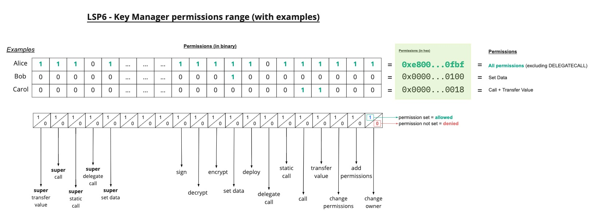

## Simple Summary

This standard describes a `KeyManager` contract with a set of pre-defined permissions for addresses. A KeyManager contract can control an [ERC725Account] like account, or any other [ERC725](https://github.com/ethereum/EIPs/blob/master/EIPS/eip-725.md) smart contract.

## Abstract

This standard allows for controlling addresses to be restricted through multiple permissions, to act on and through this KeyManager on a controlled smart contract (for example an [ERC725Account]).

The KeyManager functions as a gateway for the [ERC725Account] restricting an address actions based on set permissions.

Permissions are described in the [Permissions values section](#permission-values-in-addresspermissionspermissionsaddress). Furthermore addresses can be restricted to only talk to certain other smart contracts or address, specific functions or smart contracts supporting only specifc standard interfaces.

The Permissions are stored under the ERC725Y data key-value store of the linked [ERC725Account], and can therefore survive an upgrade to a new KeyManager contract.

The flow of a transactions is as follows:


## Motivation

The benefit of a KeyManager is to externalise the permission logic from [ERC725Y and X](https://github.com/ethereum/EIPs/blob/master/EIPS/eip-725.md) contracts (such as an [ERC725Account]). This allows for such logic to be upgraded without needing to change the core [ERC725Account] contract.

Storing the permissions at the core [ERC725Account] itself, allows it to survive KeyManager upgrades and opens the door to add additional KeyManager logic in the future, without loosing already set address permissions.


## Specification

[ERC165] interface id: `0xc403d48f`

Every contract that supports the LSP6 standard SHOULD implement:


### ERC725Y Data Keys

**The permissions that the KeyManager reads, are stored on the controlled-contracts ERC725Y data key value store (for example an [ERC725Account](./LSP-0-ERC725Account.md))**

The following ERC725Y data keys are used to read permissions of certain addresses.
These data keys are based on the [LSP2-ERC725YJSONSchema](./LSP-2-ERC725YJSONSchema.md) standard, and use the key type **[`MappingWithGrouping`](./LSP-2-ERC725YJSONSchema.md#mappingwithgrouping)**


#### AddressPermissions[]

Contains an array of addresses, that have some permission set.
This is mainly useful for interfaces to know which address holds which permissions.

```json
{
    "name": "AddressPermissions[]",
    "key": "0xdf30dba06db6a30e65354d9a64c609861f089545ca58c6b4dbe31a5f338cb0e3",
    "keyType": "Array",
    "valueType": "address",
    "valueContent": "Address"
}
```

For more informations about how to access each index of the `AddressPermissions[]` array, see: [ERC725Y JSON Schema > `keyType` `Array`](./LSP-2-ERC725YJSONSchema.md#array)

#### AddressPermissions:Permissions:\<address\>

Contains a set of permissions for an address. Permissions defines what an address **can do on** an ERC725Account (*eg: edit the data key-value store via SETDATA*), or **can perform on behalf of** the ERC725Account.

Since the `valueType` of this data key is `bytes32`, up to 255 different permissions can be defined. This includes the [ten default permissions](#permission-values-in-addresspermissionspermissionsaddress) defined below. Custom permissions can be defined on top of the default one (starting at `0x0000...8000` (`32768` in decimals)).

```json
{
    "name": "AddressPermissions:Permissions:<address>",
    "key": "0x4b80742de2bf82acb3630000<address>",
    "keyType": "MappingWithGrouping",
    "valueType": "bytes32",
    "valueContent": "BitArray"
}
```
    
#### AddressPermissions:AllowedAddresses:\<address\>

Contains an array of addresses (Externally Owned Accounts or smart contracts) a controlling address is allowed to interact with.

- IF **no addresses** are set, interacting with ANY addresses is allowed.
- IF **one or more addresses** is set, the controlling address is restricted to interact only with these addresses.

```json
{
    "name": "AddressPermissions:AllowedAddresses:<address>",
    "key": "0x4b80742de2bfc6dd6b3c0000<address>",
    "keyType": "MappingWithGrouping",
    "valueType": "address[]",
    "valueContent": "Address"
}
```

#### AddressPermissions:AllowedFunctions:\<address\>

Contains an array of [bytes4 function signatures](https://docs.soliditylang.org/en/v0.5.3/abi-spec.html?highlight=selector#function-selector), the controlling address is allowed to call on other smart contracts.

This permission acts as a restriction mechanism when interacting with other smart contracts via an ERC725Account. It enables to limit which functions an address can call on a external smart contracts via the ERC725Account.

```json
{
    "name": "AddressPermissions:AllowedFunctions:<address>",
    "key": "0x4b80742de2bf8efea1e80000<address>",
    "keyType": "MappingWithGrouping",
    "valueType": "bytes4[]",
    "valueContent": "Bytes4"
}
```

#### AddressPermissions:AllowedStandards:\<address\>

Contains an array of bytes4 [ERC165 interface Ids](https://eips.ethereum.org/EIPS/eip-165), other smart contracts MUST support, for the controlling address to be allowed to interact with.

```json
{
    "name": "AddressPermissions:AllowedStandards:<address>",
    "key": "0x4b80742de2bf3efa94a30000<address>",
    "keyType": "MappingWithGrouping",
    "valueType": "bytes4[]",
    "valueContent": "Bytes4"
}
```

#### AddressPermissions:AllowedERC725YKeys:\<address\>

Contains an array of `bytes32` ERC725Y data keys.

This data key can be used in combination with the `SETDATA` [permission](#permission-values-in-addresspermissionspermissionsaddress). It enables to restrict which data keys an `address` can set or edit on the controlled ERC725Account, by providing an [abi encoded](https://docs.soliditylang.org/en/v0.8.11/units-and-global-variables.html#abi-encoding-and-decoding-functions)) array of ERC725Y data keys.

```json
{
    "name": "AddressPermissions:AllowedERC725YKeys:<address>",
    "key": "0x4b80742de2bf90b8b4850000<address>",
    "keyType": "MappingWithGrouping",
    "valueType": "bytes32[]",
    "valueContent": "Bytes32"
}
```

Each data key defined in the array MUST be 32 bytes long. It is possible to set a range of allowed ERC725Y data keys (**= partial data keys**), by setting:
- some part of the data keys as the exact data key bytes
- the rest of the data key bytes as 0 bytes.

The 0 bytes part will represent a part that is dynamic. Below is an example based on a [LSP2 Mapping](./LSP-2-ERC725YJSONSchema.md#Mapping) key type, where first word = `SupportedStandards`, and second word = `LSP3UniversalProfile`.

```js
name: "SupportedStandards:LSP3UniversalProfile"
key: 0xeafec4d89fa9619884b60000abe425d64acd861a49b8ddf5c0b6962110481f38
```

By setting the value to `0xeafec4d89fa9619884b600000000000000000000000000000000000000000000` in the list of allowed ERC725Y data keys, one address can set any data key **starting with the first word `SupportedStandards:...`**.

### Permission Values in AddressPermissions:Permissions:\<address\>

The following permissions are allowed in the BitArray of the `AddressPermissions:Permissions:<address>` data key for an address. The order can not be changed:

```js
// right most bits ----------

// [....] 0000 0000 0000 0001 
// Allows changing the owner of the controlled contract
CHANGEOWNER         = 0x0000000000000000000000000000000000000000000000000000000000000001;
// [....] .... .... .... 0010 
// Allows adding new controller addresses by granting them some permissions
ADDPERMISSIONS      = 0x0000000000000000000000000000000000000000000000000000000000000002;
// [....] .... .... .... 0100
// Allows changing the permissions of addresses (editing + removing permissions)
CHANGEPERMISSIONS   = 0x0000000000000000000000000000000000000000000000000000000000000004;
// [....] .... .... .... 1000 
// Allows transferring value to addresses from the controlled contract
TRANSFERVALUE       = 0x0000000000000000000000000000000000000000000000000000000000000008;
// [....] .... .... 0001 .... 
// Allows calling other contracts through the controlled contract
CALL                = 0x0000000000000000000000000000000000000000000000000000000000000010;
// [....] .... .... 0010 .... 
// Allows static calling other contracts through the controlled contract, while restricting any state modifications during the call (or any sub-calls, if present)
STATICCALL          = 0x0000000000000000000000000000000000000000000000000000000000000020;
// [....] .... .... 0100 .... 
// Allows delegate calling other contracts through the controlled contract
DELEGATECALL        = 0x0000000000000000000000000000000000000000000000000000000000000040;
// [....] .... .... 1000 .... 
// Allows deploying new contracts through the controlled contract
DEPLOY              = 0x0000000000000000000000000000000000000000000000000000000000000080;
// [....] .... 0001 .... .... 
// Allows setting data on the controlled contract
SETDATA             = 0x0000000000000000000000000000000000000000000000000000000000000100;
// [....] .... 0010 .... .... 
// Allows encrypting messages on behalf of the controlled contract, for example for private messages
ENCRYPT                = 0x0000000000000000000000000000000000000000000000000000000000000200;
// [....] .... 0100 .... ....
// Allows decrypt messages on behalf of the controlled contract, for example for private messages
DECRYPT             = 0x0000000000000000000000000000000000000000000000000000000000000400
// [....] .... 1000 .... ....
// Allows signing on behalf of the controlled contract, for example for login purposes
SIGN             = 0x0000000000000000000000000000000000000000000000000000000000000800

// left most bits ----------

// .... 1000 .... .... [....]
// Same as SETDATA, but without restricting to specific data keys
SUPER_SETDATA       = 0x0800000000000000000000000000000000000000000000000000000000000000;
// 0001 .... .... .... [....]
// Same as CALL, but without restricting to specific addresses, functions or standards
SUPER_CALL          = 0x1000000000000000000000000000000000000000000000000000000000000000;
// 0010 .... .... .... [....]
// Same as STATICCALL, but without restricting to specific addresses, functions or standards
SUPER_STATICCALL    = 0x2000000000000000000000000000000000000000000000000000000000000000;
// 0100 .... .... .... [....]
// Same as DELEGATECALL, but without restricting to specific addresses, functions or standards
SUPER_DELEGATECALL  = 0x4000000000000000000000000000000000000000000000000000000000000000;
// 1000 .... .... .... [....]
// Same as TRANSFERVALUE, but without restricting to specific addresses, functions or standards
SUPER_TRANSFERVALUE = 0x8000000000000000000000000000000000000000000000000000000000000000;
```




### Methods

#### target

```solidity
function target() external view returns (address)
```

Returns the `address` of the target smart contract controlled by this Key Manager. The controlled smart contract can be one of the following:
- ERC725X contract
- ERC725Y contract
- an ERC725 contract, implementing both ERC725X and ERC725Y (e.g: an [ERC725Account]).

#### getNonce

```solidity
function getNonce(address _address, uint256 _channel) public view returns (uint256)
```

Returns the nonce that needs to be signed by an allowed key to be passed into the [executeRelayCall](#executeRelayCall) function. A signer can choose his channel number arbitrarily.

If multiple transactions should be signed, nonces in the same channel can simply be increased by increasing the returned nonce.

Read [what are multi-channel nonces](#what-are-multi-channel-nonces)

_Parameters:_

- `_address`: the address of the signer of the transaction.
- `_channel` :  the channel which the signer wants to use for executing the transaction.

_Returns:_ `uint256` , the current nonce.

#### execute

```solidity
function execute(bytes memory _calldata) public payable returns (bytes memory)
```

Execute a payload on a set [ERC725 X or Y smart contract](https://github.com/ethereum/EIPs/blob/master/EIPS/eip-725.md).

MUST fire the [Executed event](#executed).

_Parameters:_

- `_calldata`: The call data to be executed. The first 4 bytes of the `_data` payload MUST correspond to one of the function selector on the ERC725 smart contract, such as `setData(...)`, `execute(...)` or `transferOwnership(...)`.

_Returns:_ `bytes` , the returned data as abi-encoded bytes if the call on ERC725 smart contract succeeded, otherwise revert with a reason-string. 


#### executeRelayCall

```solidity
function executeRelayCall(bytes memory signature, uint256 nonce, bytes memory _calldata) public payable returns (bytes memory)
```

Allows anybody to execute `_calldata` payload on a set [ERC725 X or Y smart contract](https://github.com/ethereum/EIPs/blob/master/EIPS/eip-725.md), given they have a signed message from an executor.

MUST fire the [Executed event](#executed).

_Parameters:_
- `signature`: bytes65 ethereum signature.
- `nonce`: MUST be the nonce of the address that signed the message. This can be obtained via the `getNonce(address address, uint256 channel)` function.
- `_calldata`: The call data to be executed.


_Returns:_ `bytes` , the returned data as abi-encoded bytes if the call on ERC725 smart contract succeeded, otherwise revert with a reason-string. 

**Important:** the message to sign MUST be of the following format: `<block.chainid>` + `<KeyManager address>` + `<signer nonce>` + `<_calldata payload>` .
These 4 parameters MUST be:

- packed encoded (not zero padded, leading `0`s are removed)
- hashed with `keccak256`

The final message MUST be signed using ethereum specific signature, based on [EIP191].


### Events

#### Executed

```solidity
event Executed(uint256 indexed  _value, bytes4 _selector);
```

MUST be fired when a transaction was successfully executed.

The second parameter `_selector` in the `Executed` event corresponds to the `bytes4` selector of the function being executed in the linked [account](#account)


### What are multi-channel nonces

This concept was taken from <https://github.com/amxx/permit#out-of-order-execution>.

Using nonces prevent old signed transactions from being replayed again (replay attacks). A nonce is an arbitrary number that can be used just once in a transaction.

#### Problem of Sequential Nonces

With native transactions, nonces are strictly sequential. This means that messages with sequential nonces must be executed in order. For instance, in order for message number 4 to be executed, it must wait for message number 3 to complete.

However, **sequential nonces come with the following limitation**:

Some users may want to sign multiple message, allowing the transfer of different assets to different recipients. In that case, the recipient want to be able to use / transfer their assets whenever they want, and will certainly not want to wait on anyone before signing another transaction.

 This is where **out-of-order execution** comes in.

#### Introducing multi-channel nonces

Out-of-order execution is achieved by using multiple independent channels. Each channel's nonce behaves as expected, but different channels are independent. This means that messages 2, 3, and 4 of `channel 0` must be executed sequentially, but message 3 of channel 1 is independent, and only depends on message 2 of `channel 1`.

The benefit is that the signer key can determine for which channel to sign the nonces. Relay services will have to understand the channel the signer choose and execute the transactions of each channel in the right order, to prevent failing transactions.

#### Nonces in the KeyManager

The Key Manager allows out-of-order execution of messages by using nonces through multiple channels.

 Nonces are represented as `uint256` from the concatenation of two `uint128` : the `channelId` and the `nonceId`.

 - left most 128 bits : `channelId`
 - right most 128 bits: `nonceId`


<p align="center"><i> Example of multi channel nonce, where channelId = 5 and nonceId = 1 </i></p>


The current nonce can be queried using:

```solidity
function getNonce(address _address, uint256 _channel) public view returns (uint256)
```
Since the `channelId` represents the left-most 128 bits, using a minimal value like 1 will return a huge `nonce` number: `2**128` equal to 3402823669209384634633746074317682114**56**.

After the signed transaction is executed the `nonceId` will be incremented by 1, this will increment the `nonce` by 1 as well because the nonceId represents the first 128 bits of the nonce so it will be 3402823669209384634633746074317682114**57**.

```solidity

_nonces[signer][nonce >> 128]++

```
`nonce >> 128` represents the channel which the signer chose for executing the transaction. After looking up the nonce of the signer at that specific channel it will be incremented by 1 `++`.<br>

For sequential messages, users could use channel `0` and for out-of-order messages they could use channel `n`.

**Important:** It's up to the user to choose the channel that he wants to sign multiple sequential orders on it, not necessary `0`.


## Rationale
<!--The rationale fleshes out the specification by describing what motivated the design and why particular design decisions were made. It should describe alternate designs that were considered and related work, e.g. how the feature is supported in other languages. The rationale may also provide evidence of consensus within the community, and should discuss important objections or concerns raised during discussion.-->
This standard was inspired by how files permissions are designed in UNIX based file systems.

Files are assigned permissions as a 3 digit numbers, where each of the 3 digits is an octal value representing a set of permissions.
The octal value is calculated as the sum of permissions, where *read* = **4**, *write* = **2**, and *execute* = **1**

To illustrate, for a file set with permission `755`, the group permission (second digit) would be *read* and *execute* (See figure below). Each number is simply a **three binary placeholder, each one holding the number that correspond to the access level in r, w, x order**.


## Implementation
<!--The implementations must be completed before any LIP is given status "Final", but it need not be completed before the LIP is accepted. While there is merit to the approach of reaching consensus on the specification and rationale before writing code, the principle of "rough consensus and running code" is still useful when it comes to resolving many discussions of API details.-->

A implementation can be found in the [lukso-network/universalprofile-smart-contracts](https://github.com/lukso-network/lsp-universalprofile-smart-contracts/blob/main/contracts/LSP6KeyManager/LSP6KeyManager.sol);
The below defines the JSON interface of the `LSP3Account`.

ERC725Y JSON Schema `LSP6KeyManager`, set at the `LSP3Account`:

```json
[
    {
        "name": "AddressPermissions[]",
        "key": "0xdf30dba06db6a30e65354d9a64c609861f089545ca58c6b4dbe31a5f338cb0e3",
        "keyType": "Array",
        "valueType": "address",
        "valueContent": "Address"
    },
    {
        "name": "AddressPermissions:Permissions:<address>",
        "key": "0x4b80742de2bf82acb3630000<address>",
        "keyType": "MappingWithGrouping",
        "valueType": "bytes32",
        "valueContent": "BitArray"
    },
    {
        "name": "AddressPermissions:AllowedAddresses:<address>",
        "key": "0x4b80742de2bfc6dd6b3c0000<address>",
        "keyType": "MappingWithGrouping",
        "valueType": "address[]",
        "valueContent": "Address"
    },
    {
        "name": "AddressPermissions:AllowedFunctions:<address>",
        "key": "0x4b80742de2bf8efea1e80000<address>",
        "keyType": "MappingWithGrouping",
        "valueType": "bytes4[]",
        "valueContent": "Bytes4"
    },
    {
        "name": "AddressPermissions:AllowedStandards:<address>",
        "key": "0x4b80742de2bf3efa94a30000<address>",
        "keyType": "MappingWithGrouping",
        "valueType": "bytes4[]",
        "valueContent": "Bytes4"
    },
    {
        "name": "AddressPermissions:AllowedERC725YKeys:<address>",
        "key": "0x4b80742de2bf90b8b4850000<address>",
        "keyType": "MappingWithGrouping",
        "valueType": "bytes32[]",
        "valueContent": "Bytes32"
    }
]
```

## Interface Cheat Sheet

```solidity

interface ILSP6  /* is ERC165 */ {

    // ERC1271
    
    function isValidSignature(bytes32 hash, bytes memory signature) external view returns (bytes4 magicValue);

    
    // LSP6
        
    event Executed(uint256 indexed  value, bytes4 selector); 
   

    function target() external view returns (address);
    
    function getNonce(address address, uint256 channel) external view returns (uint256);
    
    function execute(bytes memory calldata) external payable returns (bytes memory);
    
    function executeRelayCall(bytes memory signature, uint256 nonce, bytes memory _calldata) external payable returns (bytes memory);
    

```

## Copyright

Copyright and related rights waived via [CC0](https://creativecommons.org/publicdomain/zero/1.0/).


[ERC165]: <https://eips.ethereum.org/EIPS/eip-165>
[ERC725Account]: <./LSP-0-ERC725Account.md>
[EIP191]: <https://eips.ethereum.org/EIPS/eip-191>
